# Project Name: Min-StyleMatch AI – LLM-Powered Styling & Color Analysis via MCP Server + Gradio Client

---
## 🎬 Demo Video

[](https://www.youtube.com/watch?v=VvRdsgGUVJQ)

---
## 📚 Table of Contents

- [🧠 Project Overview](#-project-overview)
- [🔧 Tools Integrated](#-tools-integrated)
- [⚠️ Project Status](#️-note-this-project-is-not-production-ready)
- [🔍 Models Used](#-models-used)
  - [📦 Open-Source Models (via Nebius)](#-open-source-models-via-nebius)
  - [🔐 Closed-Source Models (via OpenAI)](#-closed-source-models-via-openai)
- [🧩 System Architecture Overview](#-system-architecture-overview)
- [🚀 Quickstart](#-quickstart)
- [🔐 Your Data & Privacy](#-your-data--privacy)
  - [🧠 Chat History](#-chat-history)
  - [🖼️ Image Handling](#️-image-handling)
  - [🎨 Facial Color Data](#-facial-color-data)
- [✅ Dataset Overview](#-dataset-overview)
  - [🔄 Data Processing Steps](#-data-processing-steps)
  - [📦 Output](#-output)

---

## 🧠 Project Overview

This project uses **FastMCP** for custom **MCP (Model Context Protocol)** server and a **Gradio Chatbot** as an **MCP Client**, designed to demonstrate how Language Models (LLMs) can interact with tools for advanced reasoning and personalization.

### 🔧 Tools Integrated

1. **🧑‍💻 Developer Info Tool**

   * Returns information about the developer (you).
   * Purpose: Demonstrates how **MCP tool calling** supports **prompt decomposition**, allowing the LLM to delegate parts of the task to improve response accuracy and structure.

2. **🛍️ Product Filtering Tool**

   * Connects the LLM with product data stored in `.csv` files (used as a lightweight database).
   * Purpose: Showcases how LLMs can support **product recommendation systems** by filtering based on user preferences, color suitability, or product attributes.

3. **🎨 Color Season Analysis Tool**

   * Operates in an **Agent-based setup** using two LLMs:

     * One extracts **facial feature colors** (e.g., skin, eyes, hair, lips) from a user-uploaded image.
     * The second uses this data to predict the **user’s color season**.
   * Purpose: Demonstrates **multi-model collaboration**, improving accuracy by separating image understanding from season classification.
     *(Combining both steps into one model often resulted in inconsistent or random outputs.)*

---

> ⚠️ **Note:** This project is **not production-ready**.
> It is a **demo prototype** built to:
>
> * Showcase how to integrate product data with LLMs using **tool calling**.
> * Demonstrate **multi-model collaboration** (e.g., using image and text models in tandem).
> * Illustrate **prompt decomposition** and how MCP (Model Context Protocol) enables modular reasoning through tool-based workflows.
>
> While functional, the current version has **non-optimized system flow**, **basic tool logic**, and **initial prompt configurations**.
> These areas can be significantly improved for better performance, scalability, and production-readiness.
>
> This project is intended as a **learning resource** and a practical starting point for **junior developers**, **LLM enthusiasts**, or teams exploring how to combine AI tools with real-world datasets.
>
> With future iterations—such as improved orchestration, tighter prompt design, and scalable backend architecture—it can evolve into a robust, intelligent personalization system.

---

## 🔍 Models Used

### 📦 Open-Source Models (via Nebius)

* **Qwen2.5-VL-72B-Instruct** – For visual-linguistic processing.
* **Mistral-Nemo-Instruct-2407** – For general instruction-following tasks.

### 🔐 Closed-Source Models (via OpenAI)

* **GPT-4o-mini** *(primary for tool-calling)*
* **GPT-4.1-mini**

> ⚠️ *Note:* Currently, only OpenAI models are used for **tool calling**, as their API is more mature and familiar.
> I have not explored whether **Nebius supports tool calling**.

---
## 🧩 System Architecture Overview

```mermaid
graph TD
    User["🧑 User"]
    Gradio["🤖 Gradio MCP Client"]
    FastMCP["🛠️ FastMCP Server"]
    Tool1["🧑‍💻 Developer Info Tool"]
    Tool2["🛍️ Product Filter Tool"]
    Tool3["🎨 Color Season Tool"]
    LLM["🧠 LLM (OpenAI / Nebius)"]

    User --> Gradio
    Gradio --> FastMCP
    FastMCP --> Tool1
    FastMCP --> Tool2
    FastMCP --> Tool3
    Tool3 --> LLM
    Tool1 --> LLM
    Tool2 --> LLM
```



---
## 🚀 Quickstart

1. **Clone the repository**
```bash
git clone https://github.com/minkhant1996/Min-StyleMatch-AI.git
cd stylematch-assistant
pip install -r requirements.txt
```

---

## 🔐 Your Data & Privacy

This project requires the use of the **OpenAI API** and optionally the **Nebius AI Studio API**. All API keys are **encrypted** and **never exposed in plain text**.

This is a **demo project**, and for your safety and control, I recommend cloning the repository and running it locally on your machine.

### 🧠 Chat History

* Your conversation is **not stored permanently**.
* Chat history will be **cleared** if you **refresh the browser** or **close the session**.

### 🖼️ Image Handling

* When you upload a face image, it is stored **temporarily** for analysis.
* If you're **inactive** or stop interacting with the assistant, the image will be **automatically deleted**.
* No facial image is permanently saved.

### 🎨 Facial Color Data

* The extracted **skin, hair, eyes, lips colors**, and your **color season result** are handled just like your image—**temporary and private**.
* This information is only used to **enhance your personalized experience** and is **not retained** after your session ends.

---

## ✅ Dataset Overview
This project uses the [Fashion Product Images Dataset](https://www.kaggle.com/datasets/paramaggarwal/fashion-product-images-dataset) from Kaggle, which contains metadata and image filenames for over 44,000 fashion products.

The dataset consists of two key files:

* **`styles.csv`** – contains product metadata such as category, gender, and usage.
* **`images.csv`** – contains filenames of product images, linked to the product via the `id` column.


### 🔄 Data Processing Steps

The function `load_combined_dataset(styles_path, images_path)` performs the following operations:

1. **Load CSV Files**

   * Reads `styles.csv` and `images.csv`.
   * Skips malformed lines automatically to avoid read errors.

2. **Prepare for Merge**

   * Cleans the `filename` column in `images.csv` by stripping `.jpg` and converting it into integer `id` for merging.

3. **Data Cleaning**

   * Drops all rows with missing (`NaN`) values from both DataFrames.
   * Merges the two DataFrames on the `id` column using an inner join.
   * Ensures the resulting combined dataset has no null values.

4. **Filter Relevant Categories**

   * Since this is a demo, I keeps only the products that belong to **Apparel** or **Footwear** categories (ignores others such as Accessories).

### 📦 Output

The function returns a cleaned and filtered `pandas.DataFrame` containing only products ready for personalized styling and analysis.

---


